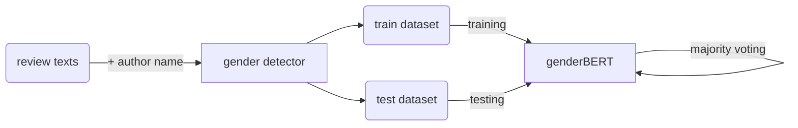

# genderBERT

TEXT

## Statistics

### Without majority-voting
| Model | Male F1 | Female F1 | Accuracy  |
|---|---|---|---|
|   |   |   |   |
|   |   |   |   |
|   |   |   |   |

### With majority voting
| Model | Male F1 | Female F1 | Accuracy  |
|---|---|---|---|
|   |   |   |   |
|   |   |   |   |
|   |   |   |   |
